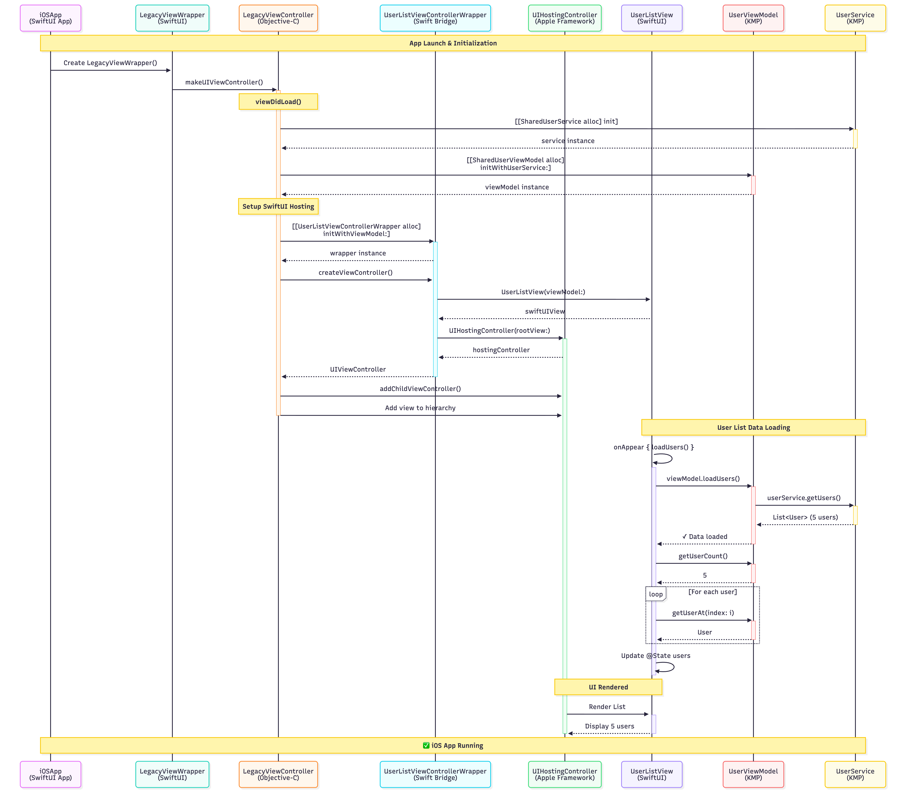
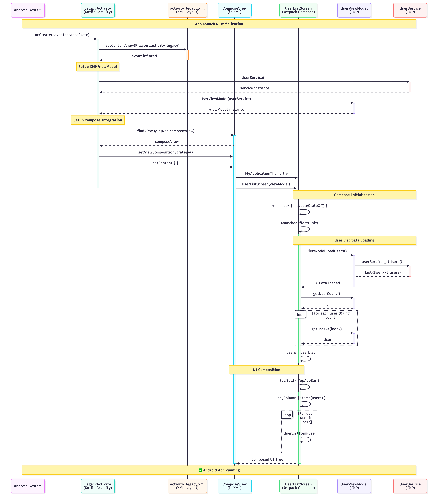

# Legacy Mobile Apps - KMP Integration Demo

This project demonstrates how to integrate **Kotlin Multiplatform (KMP)** into legacy mobile applications on both **iOS** (Objective-C) and **Android** (XML layouts).

## 🏗️ Architecture

### iOS Architecture
```
Objective-C ViewController
        ↓
  Swift Wrapper  
        ↓
UIHostingController
        ↓
   SwiftUI View
        ↓
  KMP ViewModel
        ↓
   KMP Service
        ↓
    Mock Data
```



### Android Architecture
```
XML Layout Activity
        ↓
   ComposeView
        ↓
Jetpack Compose UI
        ↓
  KMP ViewModel
        ↓
   KMP Service
        ↓
    Mock Data
```



## ✅ What Works

Both iOS and Android demonstrate:
- **Legacy UI Layer**: Objective-C (iOS) / XML Layout (Android)
- **Bridge Layer**: Swift Wrapper + UIHostingController (iOS) / ComposeView (Android)
- **Modern UI**: SwiftUI (iOS) / Jetpack Compose (Android)
- **Shared Business Logic**: KMP ViewModel and Service
- **Same Data**: 5 mock users displayed in a list

## 📱 What You'll See

A list of 5 users on both platforms:
1. **John Doe** - john.doe@example.com
2. **Jane Smith** - jane.smith@example.com
3. **Bob Johnson** - bob.johnson@example.com
4. **Alice Williams** - alice.williams@example.com
5. **Charlie Brown** - charlie.brown@example.com

## 🚀 How to Run

### Build KMP Shared Module (Required for Both)
```bash
cd /Users/adamdahan/Developer/iheartsolana/Legacy
./gradlew :shared:build
```

### iOS

#### 1. Install Dependencies
```bash
cd iosApp
pod install
```

#### 2. Open in Xcode
```bash
open iosApp.xcworkspace
```

#### 3. Run
- Select **iPhone 16** or any simulator
- Press **Cmd+R** to build and run

### Android

#### 1. Build APK
```bash
./gradlew :androidApp:assembleDebug
```

#### 2. Run in Android Studio
- Open project in Android Studio
- Select an emulator or device
- Click **Run** (or Shift+F10)

#### Or Install Directly
```bash
./gradlew :androidApp:installDebug
```

## 📂 Project Structure

### KMP Shared (`shared/src/commonMain/kotlin/`)
```
com/adamdahan/cibc/legacy/
├── User.kt                 # Data model (shared)
├── UserService.kt          # Service with mock data (shared)
└── UserViewModel.kt        # Business logic (shared)
```

### iOS (`iosApp/iosApp/`)
```
├── LegacyViewController.h/.m              # Objective-C entry point
├── UserListViewControllerWrapper.swift    # Swift bridge for generics
├── UserListView.swift                     # SwiftUI list view
├── LegacyViewControllerBridge.swift       # SwiftUI wrapper
└── iosApp-Bridging-Header.h              # Objective-C ↔ Swift bridge
```

### Android (`androidApp/src/main/`)
```
├── res/layout/activity_legacy.xml         # XML layout with ComposeView
├── java/.../LegacyActivity.kt            # Legacy Activity entry point
└── java/.../UserListComposable.kt        # Jetpack Compose UI
```

## 🔑 Key Techniques

### iOS: Objective-C → Swift Generics

Since `UIHostingController<Content>` is generic, we use a wrapper:

```swift
@objc class UserListViewControllerWrapper: NSObject {
    @objc func createViewController() -> UIViewController {
        let swiftUIView = UserListView(viewModel: viewModel)
        return UIHostingController(rootView: swiftUIView)
    }
}
```

```objc
// In Objective-C
SharedUserService *service = [[SharedUserService alloc] init];
SharedUserViewModel *viewModel = [[SharedUserViewModel alloc] initWithUserService:service];
```

### Android: XML → Jetpack Compose

ComposeView bridges traditional XML layouts with Compose:

```xml
<!-- activity_legacy.xml -->
<androidx.compose.ui.platform.ComposeView
    android:id="@+id/composeView"
    android:layout_width="match_parent"
    android:layout_height="match_parent" />
```

```kotlin
// In Kotlin Activity
val composeView = findViewById<ComposeView>(R.id.composeView)
composeView.setContent {
    MyApplicationTheme {
        UserListScreen(viewModel = viewModel)
    }
}
```

## 📊 Architecture Comparison

| Aspect | iOS | Android |
|--------|-----|---------|
| **Legacy Layer** | Objective-C ViewController | XML Layout Activity |
| **Bridge** | UIHostingController | ComposeView |
| **Modern UI** | SwiftUI | Jetpack Compose |
| **KMP Access** | `Shared` prefix in ObjC | Direct in Kotlin |
| **View System** | UIKit → SwiftUI | View → Compose |

## ✨ Benefits

### Cross-Platform
- **100% Code Sharing**: Business logic shared between iOS & Android
- **Type Safety**: Kotlin's type system reduces bugs on both platforms
- **Single Source of Truth**: One ViewModel, one Service, one Data Model

### Per Platform
- **Gradual Migration**: No need to rewrite entire app
- **Legacy Support**: Works with existing code (Objective-C/XML)
- **Modern UI**: Use SwiftUI/Compose for new features
- **Team Flexibility**: Developers can work with familiar tools

## 🎯 Next Steps

1. ✅ Add network calls with Ktor
2. ✅ Implement proper state management (StateFlow)
3. ✅ Add navigation between screens
4. ✅ Handle loading/error states
5. ✅ Add unit tests for shared code
6. ✅ Implement deep linking

## 🏆 What This Demonstrates

### Real-World Pattern
This project shows a **production-ready** pattern for:
- Migrating legacy apps to modern architectures
- Introducing KMP into existing codebases
- Sharing business logic across platforms
- Bridging old and new UI frameworks

### Architecture Highlights
- ✅ **Legacy Entry Points**: Objective-C & XML layouts
- ✅ **Modern UI**: SwiftUI & Jetpack Compose  
- ✅ **Shared Logic**: 100% code sharing for ViewModels & Services
- ✅ **Type Safety**: Full type safety across platforms
- ✅ **Production Ready**: Builds successfully on both platforms

## 📚 Documentation

### 📊 Sequence Diagrams
- **[SEQUENCE_DIAGRAMS.md](SEQUENCE_DIAGRAMS.md)** - Detailed Mermaid diagrams showing:
  - iOS data flow (Objective-C → SwiftUI → KMP)
  - Android data flow (XML → Jetpack Compose → KMP)
  - Component interactions and architecture comparisons
  - Step-by-step execution flow for both platforms

### 🔍 Platform Comparison
- **[PLATFORM_COMPARISON.md](PLATFORM_COMPARISON.md)** - Side-by-side comparison of iOS vs Android integration

### iOS-Specific
- Objective-C interop with Swift generics
- UIHostingController integration
- Bridging headers configuration
- CocoaPods integration

### Android-Specific
- ComposeView in XML layouts
- Activity-based Compose integration
- ViewBinding with Compose
- Gradle configuration

### KMP-Specific
- Shared ViewModels
- Shared Services
- Data model sharing
- Platform-specific naming (Shared prefix on iOS)

---

## ✅ Status

**iOS**: ✅ Builds successfully  
**Android**: ✅ Builds successfully  
**Shared KMP**: ✅ Compiles and links correctly  

**Ready to run on both platforms!** 🎉

---

## 🛠️ Technical Stack

| Layer | iOS | Android | Shared (KMP) |
|-------|-----|---------|--------------|
| **Legacy UI** | Objective-C | XML Layout | - |
| **Bridge** | UIHostingController | ComposeView | - |
| **Modern UI** | SwiftUI | Jetpack Compose | - |
| **ViewModel** | - | - | Kotlin |
| **Service** | - | - | Kotlin |
| **Model** | - | - | Kotlin |

## 📖 Learning Resources

- [Kotlin Multiplatform Documentation](https://kotlinlang.org/docs/multiplatform.html)
- [UIHostingController (iOS)](https://developer.apple.com/documentation/swiftui/uihostingcontroller)
- [ComposeView (Android)](https://developer.android.com/reference/kotlin/androidx/compose/ui/platform/ComposeView)
- [KMP Best Practices](https://kotlinlang.org/docs/multiplatform-mobile-getting-started.html)

---

**Created by**: Adam Dahan  
**Purpose**: Demonstrate legacy app modernization with Kotlin Multiplatform  
**License**: MIT
